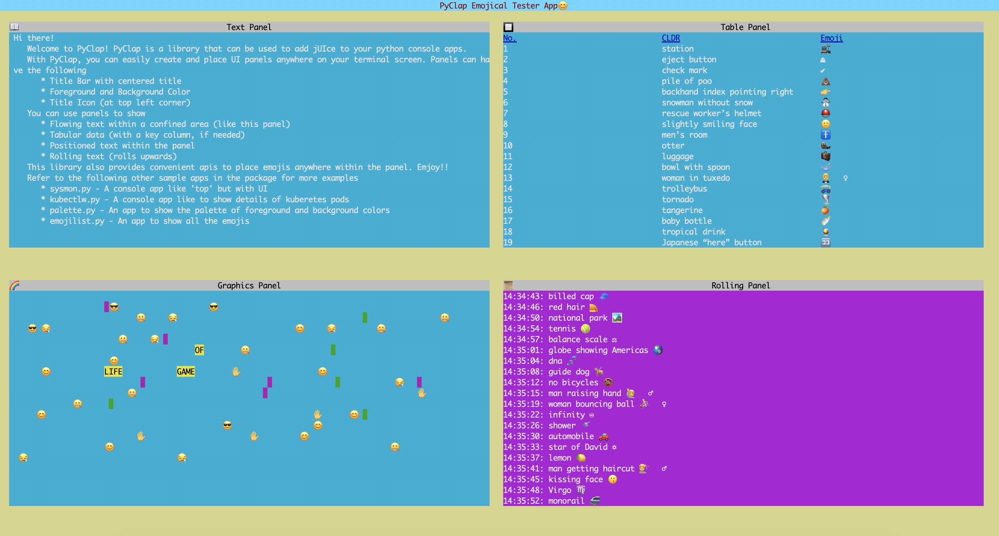
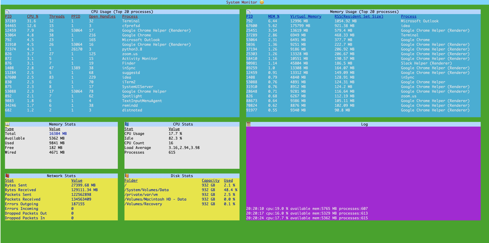
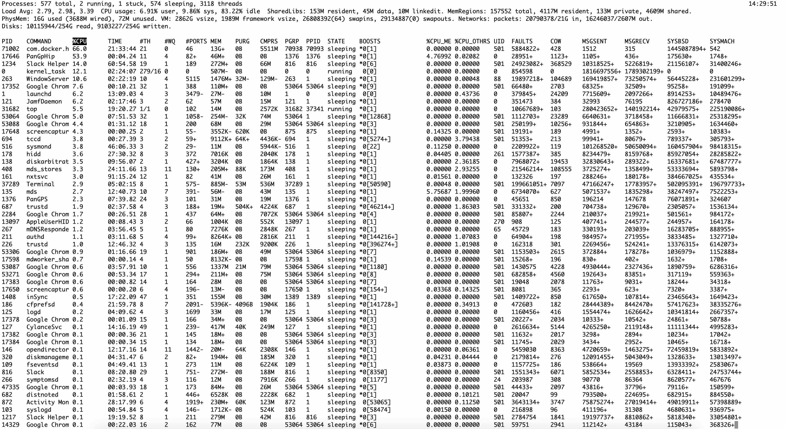
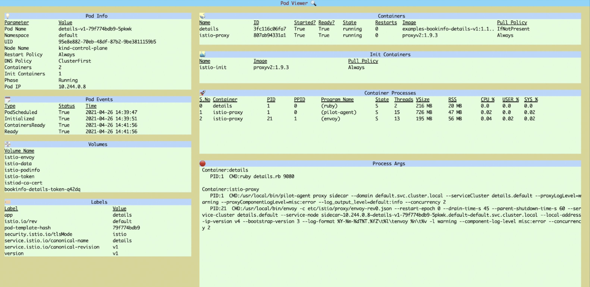
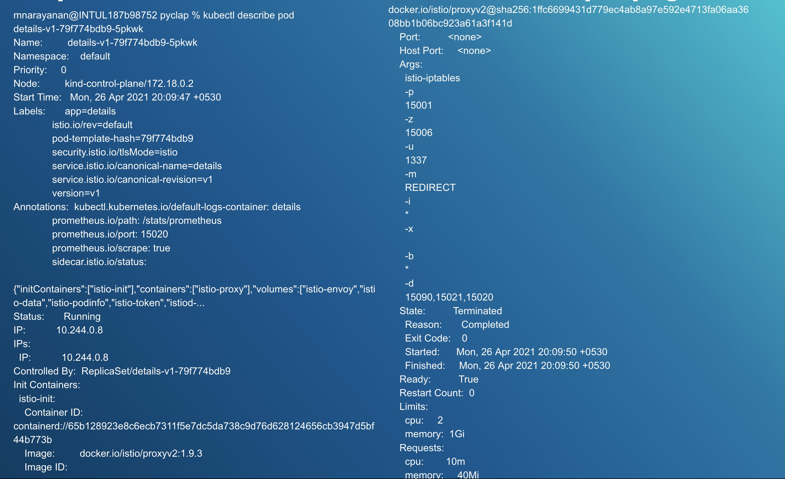
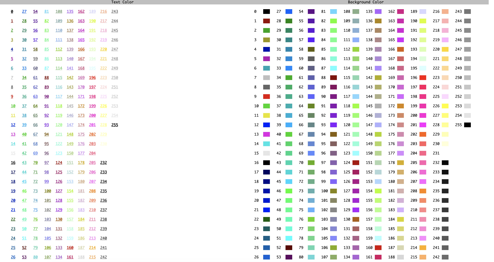

# **`pyclap`**
A Python library for building rich Command-Line Applications with panels and positioned text  

Hi there!  

Welcome to PyClap! PyClap is a library that can be used to add jUIce to your python console apps.
   With PyClap, you can easily create and place UI panels anywhere on your terminal screen. Panels can have the following  
* Title Bar with centered title  
* Foreground and Background Color  
* Title Icon (at top left corner)  

You can use panels to show  
* Flowing text within a confined area (like this panel)
* Tabular data (with a key column, if needed)
* Positioned text within the panel
* Rolling text (rolls upwards)  

This library also provides apis to place emojis anywhere within the panel.  

Refer to the following other sample apps in the package for more examples  
* tester.py - A sample app that shows different panels   
* sysmon.py - A console app like 'top' but with UI. Needs python package 'psutil'
* kubectlw.py - A console app like to show details of kuberetes pods
* palette.py - An app to show the palette of foreground and background colors
* emojilist.py - An app to show all the emojis

Tester App
* Run `python samples/tester.py`

Sysmon
* Install package psutil `pip install psutil`
* Run `python samples/sysmon.py`

Compare this with output of "top"

kubectlw
* Run `python samples/kubectlw.py get pod <podname>`  
For e.g `python samples/kubectlw.py get pod details-v1-79f774bdb9-5pkwk`

Compare this with the output of 'kubectl describe details-v1-79f774bdb9-5pkwk'

palette.py
* To visually identify the color codes for foreground and background colors, run `python samples/palette.py`  

